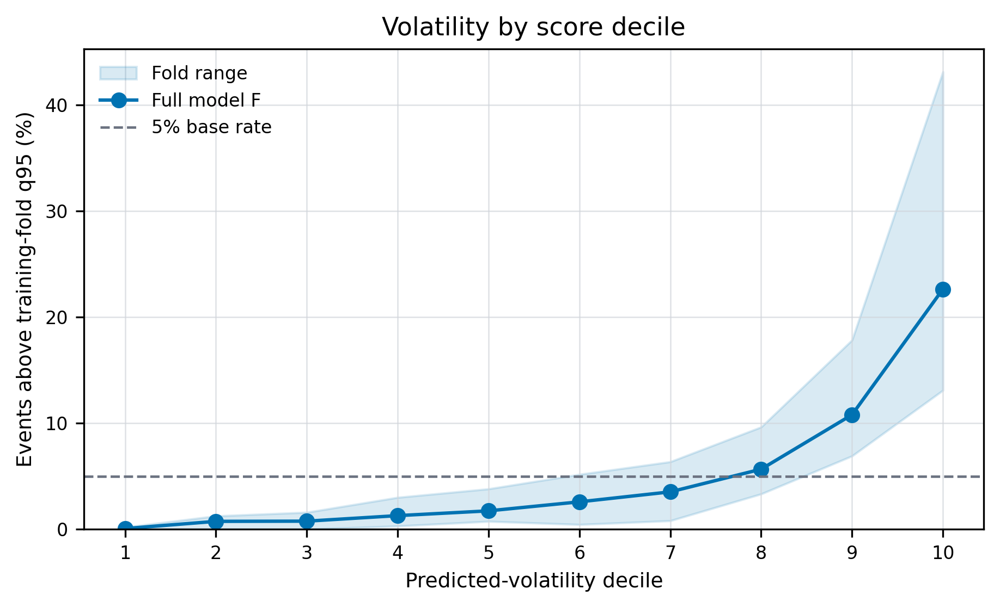
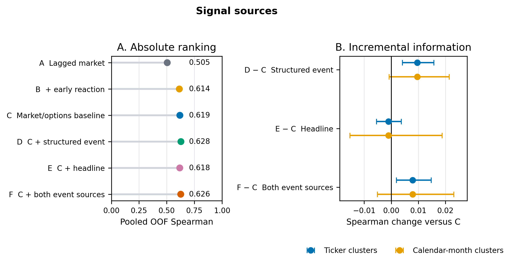
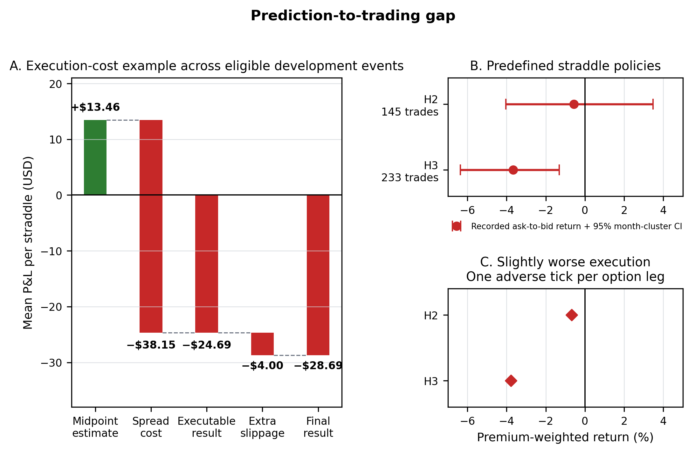
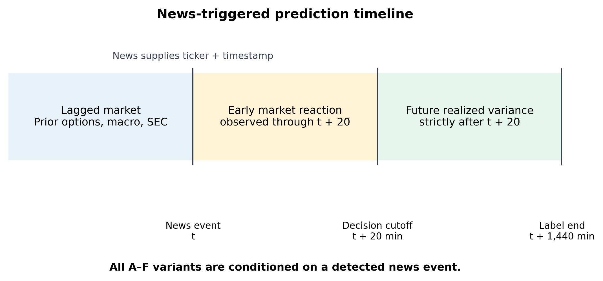

# Research figures

These are the original study figures included in the [paper](../paper/final_paper.pdf).

## Volatility by score decile

Events are grouped by predicted volatility. The curve shows the percentage exceeding each training fold's realized-variance 95th percentile, weighted across validation folds. The shaded band is the fold minimum–maximum, not a confidence interval.

## Sources of the signal

A–C successively add lagged market information, the initial market reaction, and options/macro context. D, E, and F separately add structured event information, headline text, or both to C. The intervals resample whole tickers or calendar months. None of the event-information additions passed the prespecified, multiple-testing-adjusted rule.

## Prediction and trading costs

The midpoint example becomes negative at executable prices. The separate exact-straddle confirmation also produces negative returns. These panels use different cohorts and should not be read as one sequential experiment. Adverse-tick sensitivities are point estimates; intervals were not produced for that sensitivity.

## Prediction timeline

News identifies the ticker and event time. Features stop at the +20-minute decision; the target uses returns strictly afterward through +24 hours.
